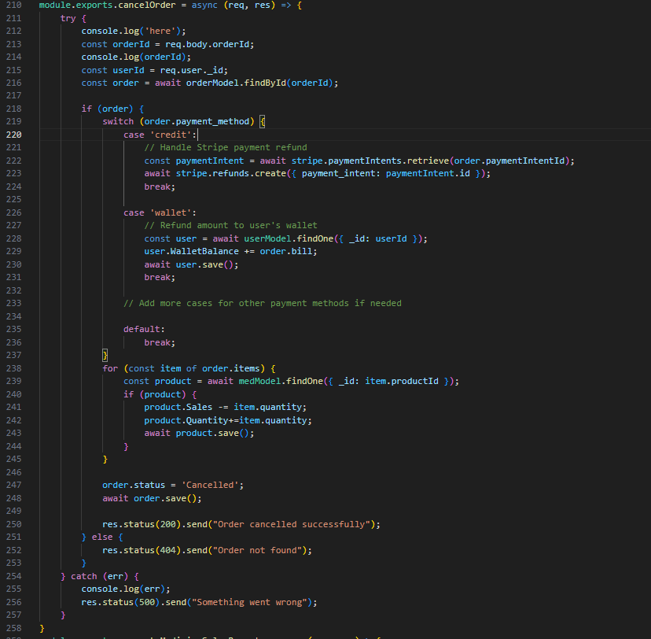
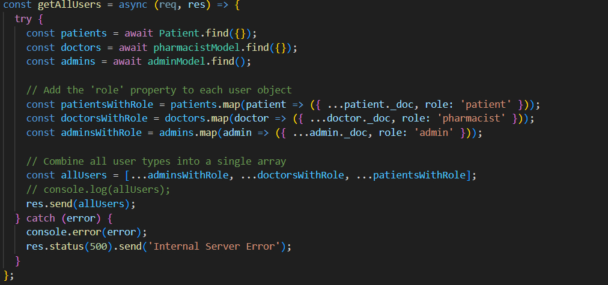
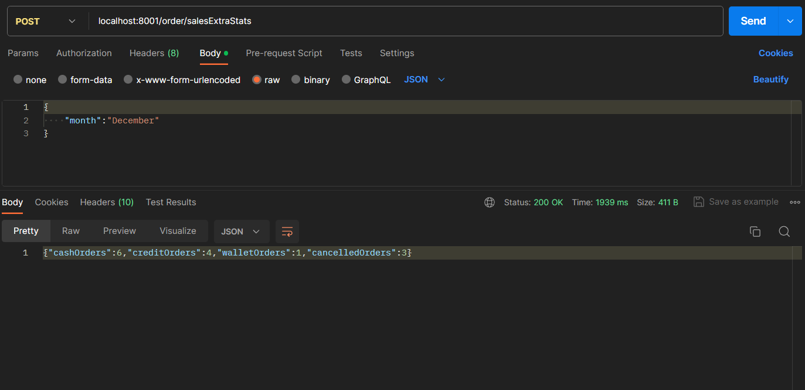
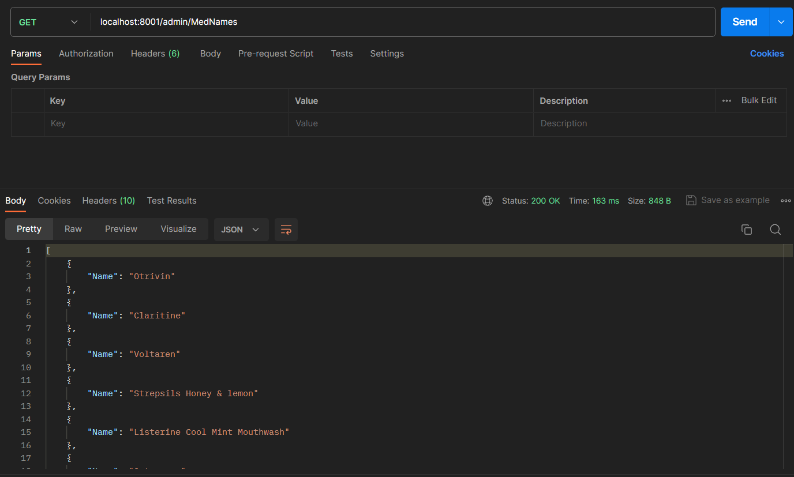
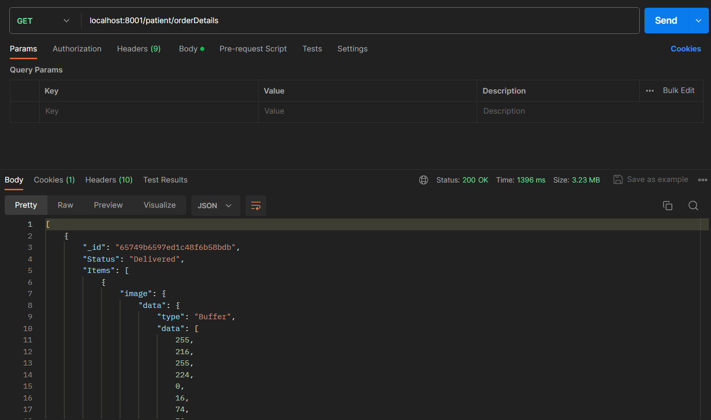
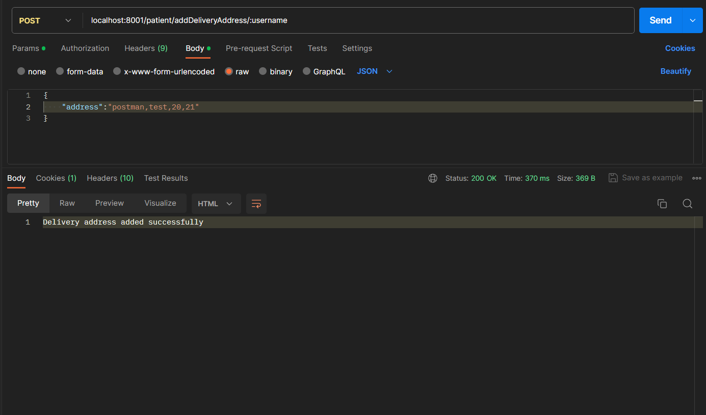
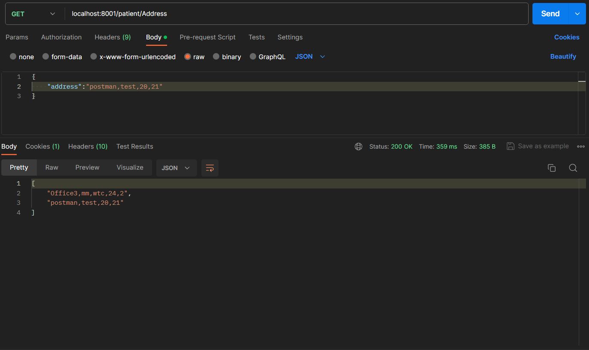
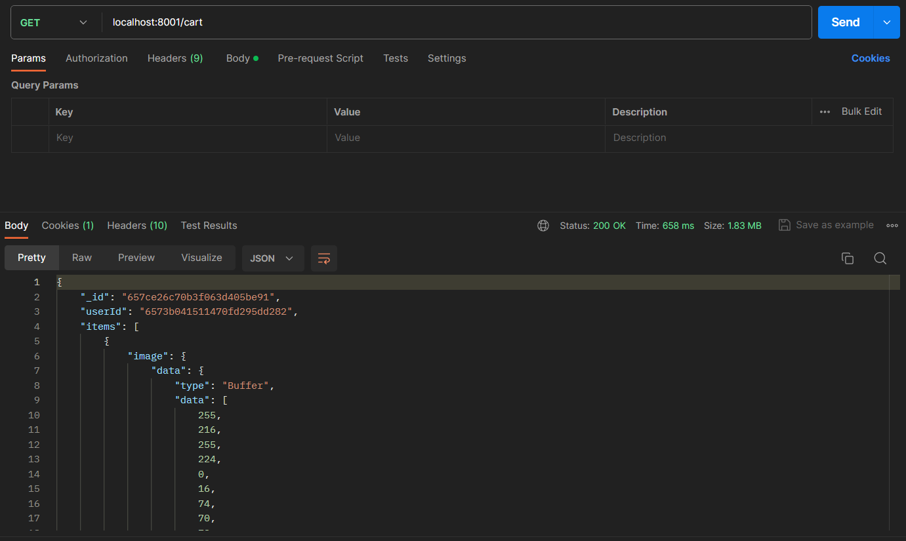
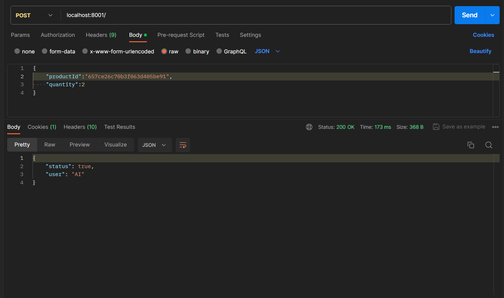

PillStack is an online pharamcy linked to PillStack's online clinic. This MERN stack project aims to eradicate the challenges associated with physical hospital visits by providing a complete digital healthcare solution.

# Motivation

This project serves as a learning opportunity to collaborate effectively within a team setting, specifically focusing on the development of a MERN Stack project. The primary objectives include gaining practical experience in meeting both Functional and Non-Functional Requirements, navigating diverse APIs, and cultivating a consistent coding style.
# Build Status
- The system currently does not allow the user to top up their wallet balance. However in the future we intend to add this feature.
- The system does not verify the user's email upon registeration.
- The system does not provide real life tracking of orders.
- The system does not have an interface for people in charge of delivery.
- For reporting bugs or offering contributions or enhancements please check our Contributions section below.  

# Screenshots
- Login Page

- Patient home page
- View all doctors on the platform
- Book an appointment
- chat with a doctor 
- Add a family member
- View linked family members
- View my appointments
- View my family's appointments
- View my health packages
- Subscribe to a health package
- Doctor's home page
- View doctor's patients
- chat with a patient
- Add an appoinmment to my bookings
- Accept/Reject a follow up requested by a patient
- Schedule a follow up for a patient
- Admin home page
- Add a new admin to the system
- Delete a user from the system
- View doctor's applications

 

# Code Style
### Code Formatting
- Use 4-space indentation.
- Line length should not exceed 80 characters.
- End statements with semicolons.

### Naming Conventions
- Variables: camelCase
- Functions: snake_case

### Code Organization
- Group related files into directories (e.g., /src, /tests).

### Comments and Documentation
- Use comments to explain complex logic or non-obvious code parts.

### Version Control Practices
- Use concise and descriptive commit messages following the conventional commits specification.

# Tech/Frameworks used 
### This project was fully implemented using MERN Stack.
##### MERN Stack is a popular and robust combination of technologies used for building web applications. The acronym MERN stands for MongoDB, Express.js, React, and Node.js, which are the four core technologies that make up this stack. 
#### Backend
- Node.js: A JavaScript runtime for server-side development.
- Express.js: A web application framework for Node.js.
- MongoDB: A NoSQL database for storing application data.
- Socket.IO: A JavaScript library for enabling real-time, bidirectional communication between web clients and servers.
#### Frontend
- React.js: A JavaScript library for building user interfaces.
- Axios: A promise-based HTTP client for making HTTP requests.
#### Development & Testing
- Postman : For testing API endpoints during development.

# Features

### The system serves different roles of users:

1. Guest:

 As a Guest, I could:  

- Register as a patient.  
- Submit a request to register as a pharmacist .

2. Patient:

As a Patient, I could: 
- Add prescription medicines based on a recent prescription.
- Add/Update/Delete items to my cart.
- Choose to pay for an order using wallet,credit card,or cash on delivery.
- View my current and past orders.
- Cancel an order.
- Chat with a pharmacist.
- add a new delivery address.
- Reset a forgotten password through OTP sent to email.

3. Pharmacist
As a Pharmacist, I could: 

- View available quantity and sales of each medicine.
- Add a medicine with details.
- Edit medicine details and price.
- Archive/unarchive medicines. 
- Chat with a doctor from clinic.
- Reset a forgotten password through OTP sent to email.

4. Admin:
As a Doctor, I could:
- View total sales report.
- View available medicine.
- Archive/unarchive medicines.
- Add another administrator with specific credentials.
- Remove a pharmacist/patient/admin from the system.
- View and accept or reject a pharmacist's request to join the platform.
- Add/update/delete health packages.
- Reset a forgotten password through OTP sent to email.

 

# Code Example
Patient order cancellation function:

Cart delete item function:

Admin get all users on the platform function:

# Installation
1.Clone Repository to your device `https://github.com/advanced-computer-lab-2023/Pill-Stack-Pharmacy.git`  
  

  
2.Open 2 terminals  
  
3.In the first terminal run the following commands:  
 `cd backend`  
 `npm install`  
 `cd src`  
 `nodemon app.js`  
    
4.In the second terminal run the following commands:  
`cd frontend`  
`npm install`  
`cd src`  
`npm start`
    
Your default browser should automatically open on the web application's address.

# API Refrences
Our APIs are divided into 6 APIs:
### Authentication Router
#### Route : (/)
#### Authenticate a user
- #### Route: /login
- #### Request type: post
- #### Request Body: `{username: 'Mariam', password: 'Ma12345'}`
### Handles secure registration of patients 
- #### Route: /Patientregister
- #### Request type: post
- #### Request Body: `{username:'Rawan', name:'RawanM',email:'Rou@gmail.com',password:'mdmd123',dob: '1990-01-01',gender: 'female',mobile:'0122354554',EmergencyContact_Name:'rouu',EmergencyContact_MobileNumber:'01233334455',EmergencyContact_Relation:'Mother'}`
### Create a new admin user
- #### Route: /administration
- #### Request type: post
- #### Request Body: `{Username: 'Rou', password:'Mssaie1234', email:'rou@gmail.com'}`
### Change user password
- #### Route: /changePassword
- #### Request type: post
- #### Middleware: userVerification
- #### Request Body: `{oldPassword:'Mskaoe12', newPassword:'Maadjei1289', Username:'Rou'}`
### send OTP for user verification
- #### Route: /sendOTP
- #### Request type: post
- #### Request Body: `{email:'Rou@gmail.com'}`
### Reset user password with OTP verification
- #### Route: /resetPassword
- #### Request type: post
- #### Request Body: `{otp: '78548',email:'rou@gmail.com',newPassword:'Mass1254'}`
### Reset user password without OTP verification
- #### Route: /resetPass
- #### Request type: post
- #### Request Body: `{email:'rou@gmail.com',newPassword:'Mass1254'}`
### Verify the validity of the OTP
- #### Route: /checkOTP
- #### Request type: post
- #### Request Body: `{email:'rou@gmail.com', otp:'12458'}`
### Register a pharmaceutical professional
- #### Route: /doc_register
- #### Request type: post
- #### Request Body: `{username:'Rawan', name:'RawanM',email:'Rou@gmail.com',password:'mdmd123',dob: '1990-01-01',hourly_rate: 50, affiliation:'Pharmacy Affiliation',educational_background: "Pharmacy Education Background",IDDocument:'file content here',pharmacyDegreeDocument: 'file content here',workingLicenseDocument: 'file content here'}`   

### Admin Router
#### Route : (/admin)
#### Retrieves all pharmacist registration applications
- #### Route: /applications
- #### Request type: get
#### Displays details of a specific pharmacist registration application
- #### Route: /applications/view/:id
- #### Request type: get
- #### Request header: `{id: 'mongoose.type.objectId()'}`
#### Renders the page to view patient details
- #### Route: /PatientDetails
- #### Request type: get
#### Retrieves patient details based on the provided username or all patients
- #### Route: /PatientDetailsResults
- #### Request type: get
- #### Request query: `{username: 'rouu'}`
#### Renders the page to view pharmacist details
- #### Route: /PharmacistDetails
- #### Request type: get
#### Retrieves details of a specific pharmacist
- #### Route: /PharmacistDetailsResults
- #### Request type: get
- #### Request query: `{username: 'rouu'}`
#### Returns a list of all users with their respective roles
- #### Route: /allUsers
- #### Request type: get
#### Retrieves full information about a specific admin
- #### Route: /myInfo/:username
- #### Request type: get
- #### Request Header: `{username: 'rouu'}`
#### Accepts a pharmacist registration request
- #### Route: /applications/accept-registeration/:id
- #### Request type: post
- #### Request Header: `{id: 'mongoose.type.objectId()'}`
#### Rejects a pharmacist registration request
- #### Route: /applications/reject-registeration/:id
- #### Request type: post
- #### Request Header: `{id: 'mongoose.type.objectId()'}`
#### Retrieves the names of all medicines
- #### Route: /MedNames
- #### Request type: get
#### Removes a user (admin, patient, pharmacist) from the system
- #### Route: /removeUser
- #### Request type: post
- #### Request Body: `{id:'mongoose.type.objectId()', role:'patient'}`
#### Retrieves a list of available medicines
- #### Route: /availableMedicines
- #### Request type: get

#### Retrieves a list of available medicines of quantity greater than zero
- #### Route: /availableMedicinesPH
- #### Request type: get
#### Filters medicines based on medicinal use
- #### Route: /filter-medicines
- #### Request type: get
- #### Request query: `{medicinalUse:'aaa'}`
#### Renders the page to search for a specific medicine
- #### Route: /searchMedicine
- #### Request type: get

#### Searches for a specific medicine by name
- #### Route: /searchMedicine
- #### Request type: post
- #### Request Body: `{name:'panadol'}`
### Cart Router 
#### Route : (/cart)
#### Retrieves the items in the user's cart
- #### Route: /cart
- #### Request type: get
- #### Middleware: userVerification
#### Adds an item to the user's cart
- #### Route: /cart
- #### Request type: post
- #### Middleware: userVerification
- #### Request Body: `{productId: 'mongoose.type.objectId()', quantity: '1'}`
#### Updates the quantity of an item in the user's cart
- #### Route: /update
- #### Request type: post
- #### Middleware: userVerification
- #### Request Body: `{productId: 'mongoose.type.objectId()', quantity: '1'}`

#### Updates the quantity of an item in the user's cart
- #### Route: /:itemId
- #### Request type: delete
- #### Middleware: userVerification
- #### Request Header: `{itemId: 'mongoose.type.objectId()'}`
### Order Router
#### Route : (/order)
#### Retrieves the most recent order for the authenticated user
- #### Route: /recent
- #### Request type: get
- #### Middleware: userVerification
#### Initiates the checkout process using credit card payment
- #### Route: /orderCredit
- #### Request type: post
- #### Middleware: userVerification

#### Confirms the credit card payment
- #### Route: /orderCredit/confirm
- #### Request type: post
- #### Middleware: userVerification
- #### Request Body: `{address: 'cairo', intentId: 'mongoose.type.objectId()'}`

#### Checkout process using cash on delivery
- #### Route: /orderCash
- #### Request type: post
- #### Middleware: userVerification
- #### Request Body: `{address: 'cairo'}`
#### Checkout process using the user's wallet balance
- #### Route: /orderWallet
- #### Request type: post
- #### Middleware: userVerification
- #### Request Body: `{address: 'cairo'}`
#### Cancels an order and handles necessary actions
- #### Route: /cancel-order
- #### Request type: post
- #### Middleware: userVerification
- #### Request Body: `{orderId: 'mongoose.type.objectId()'}`
#### Generates a report of a specific medicine sales of each month
- #### Route: /sales
- #### Request type: post
- #### Request Body: `{med: 'panadol',month:'January'}`
#### Retrieves overall statistics for sales in a specified month
- #### Route: /salesStats
- #### Request type: post
- #### Request Body: `{month:'January'}`
#### daily revenue
- #### Route: /salesDaily
- #### Request type: post
- #### Request Body: `{month:'January'}`
#### Retrieves all orders for a specified month
- #### Route: /salesOrder
- #### Request type: post
- #### Request Body: `{month:'January'}`

#### Gets the number of orders for cash,credit,wallet, and cancelled orders
- #### Route: /salesExtraStat
- #### Request type: post
- #### Request Body: `{month:'January'}`

### Patient Router
#### Route : (/patient)

#### Retrieves the delivery addresses of the user
- #### Route: /Address
- #### Request type: get

#### Retrieves details of orders made by the user
- #### Route: /orderDetails
- #### Request type: get

#### Retrieves full information about a user
- #### Route: /myInfo/:username
- #### Request type: get
- #### Request header: `{username: 'Mariam'}`

#### Filters medicines based on medicinal use
- #### Route: /filter-medicines
- #### Request type: get
- #### Request query: `{medicinalUse: 'Fever'}`

#### Searches for a medicine by name
- #### Route: /searchMedicine
- #### Request type: post
- #### Request Body: `{name: 'Panadol'}`

#### Add a new delivery address for the specified user
- #### Route: /addDeliveryAddress/:username
- #### Request type: post
- #### Request Body: `{address: 'cairo'}`
- #### Request Header: `{username: 'Mariam'}`

#### Retrieves usernames of pharmacists
- #### Route: /getDoctorUsername/:username
- #### Request type: get

#### Creates or joins a chat room for communication between a patient and pharmacist
- #### Route: /Chat/:username/:doctorUsername
- #### Request type: post
- #### Request header: `{username: 'mariam', doctorUsername:'doctorTesting'}`

#### Sends a message in the chat room between a patient and pharmacist
- #### Route: /sendMessage/:patientUsername/:selectedDoctor
- #### Request type: post
- #### Request header: `{PatientUsername: 'mariam', selectedDoctor:'doctorTesting'}`

#### Retrieves details of a specific medicine
- #### Route: /medicine/details
- #### Request type: post
- #### Request body: `{medicineID: 'mongoose.type.objectId()'}`

### Pharmacist Router
#### Route : (/pharmacist)

#### Update Medicine's price and details in the database
- #### Route: /medicine/details
- #### Request type: put
- #### Request body: `{medicineName: 'panadol', newPrice:'500',newDetails:'mmmm'}`

#### Changes the status of a medicine
- #### Route: /changeMedicineStatus/:id
- #### Request type: put
- #### Request header: `{id: 'mongoose.type.objectId()'}`

#### Adds a new medicine to the database
- #### Route: /createMedicine
- #### Request type: post
- #### Request Body: `{name: 'panadol', details:'anti-inflammatory',quantity:'50',price:'50',medicinalUse:'Inflammation',image:'Image'}`

#### Searches for a medicine by name
- #### Route: /searchMedicine
- #### Request type: post
- #### Request Body: `{name: 'panadol'}`

#### Filters medicines based on medicinal use.
- #### Route: /filter-medicines
- #### Request type: get
- #### Request query: `{medicinalUse: 'Inflammation'}`

#### Retrieves usernames of patients
- #### Route: /getPatientUsername/:username
- #### Request type: get
- #### Request header: `{username: 'Mariam'}`

#### Creates or joins a chat room for communication between a pharmacist and a patient
- #### Route: /ChatDoctor/:doctorUsername/:username
- #### Request type: post
- #### Request header: `{doctorUsername: 'doctorName',username:'Mariam'}`

####  Sends a message in the chat room between a pharmacist and a patient
- #### Route: /sendMessage/:patientUsername/:doctorUsername
- #### Request type: post
- #### Request header: `{patientUsername:'mariam',doctorUsername: 'doctorName'}`
- #### Request Body: `{message:'hi'}`

####  Retrieves usernames of doctors
- #### Route: /getDoctorUsername/:username
- #### Request type: get

####  Creates or joins a chat room for communication between a pharmacist and a doctor clinic
- #### Route:/ChatDoctor2/:doctorUsername/:docClinUsername
- #### Request type: post
- #### Request header: `{doctorUsername: 'doctorName',docClinUsername:'mariam'}`

####  Sends a message in the chat room between a pharmacist and a doctor clinic
- #### Route:/sendMessage2/:docClinUsername/:doctorUsername
- #### Request type: post
- #### Request header: `{docClinUsername: 'doctorName',doctorUsername:'mariam'}`
- #### Request Body: `{message: 'hello'}`

# Postman Testing
Monthly sales statistics regarding wallet, credit, cash, and cancelled orders  
 
View all medicines listed 
 
Patient's past orders  
  
Adding a new delivery address
  
Patient's delivery addresses
 
Patient's cart
 
Adding items to cart
  
# How to Use
1. Open `http://localhost:3001/ ` to view the login page in your browser.  
 
2. Register as a patient in order to be able to login into the system.  
3. Enter your registered credientials, and a redirection to the home page will occur.  
4. 

# Contribute 
Thank you for considering contributing to our project! We welcome contributions from everyone.
## Contribution Guidelines  
### Issues
- Reporting Bugs: If you find a bug or issue, please send us an email on `pillstackacl@gmail.com` mentioning the issue with a clear description.  
- Fixing Bugs: Fork the repository, create a new branch, and submit a pull request referencing the issue.
### Feature Requests
- Requesting Features: Propose new features by emailing us on `pillstackacl@gmail.com` to discuss changes.
- Implementing Features: Coordinate with developers before implementing new features.  

#### We appreciate your interest and support in making this project better!  
#### Feel free to modify this template to suit your project's specific guidelines and needs. 
# Credits
- [Node.js](https://youtube.com/playlist?list=PLZlA0Gpn_vH_uZs4vJMIhcinABSTUH2bY&si=xl9Ckfm1dduvf3mB) 
- [Express](https://www.youtube.com/watch?v=fgTGADljAeg)
- [React](https://youtube.com/playlist?list=PLZlA0Gpn_vH_NT5zPVp18nGe_W9LqBDQK&si=cxXCnx404gvfF9kF)
- [React Hooks](https://youtube.com/playlist?list=PLZlA0Gpn_vH8EtggFGERCwMY5u5hOjf-h&si=VL42ZHFVRkgV10hr)
- [JWT Authentication](https://www.freecodecamp.org/news/how-to-secure-your-mern-stack-application/)
- [Stripe](https://youtu.be/e-whXipfRvg?si=-zWhuRFVhuLKciS9)  
# License
- The Stripe is licensed under the [Apache License 2.0](https://www.apache.org/licenses/LICENSE-2.0.txt)

 

 

